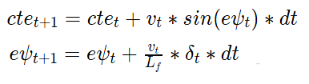

# MPC Control

1. Run `./start.sh` in `src/` folder.

There are two actuators. Stearing angle (δ) is the first one, it should be in range [-25,25] deg. For simplicity the throttle and brake represented as a singular actuator (a), with negative values signifying braking and positive values signifying acceleration. It should be in range [-1,1].

cross track error (_cte_) and _ψ_ error (_eψ_) were used to build the cost function for the MPC. They could be updated on a new time step using the following equations:

One of the most important tasks was to tune parameters of the cost function and other parameters for the Model Predictive Controller.

First of all, data about waypoints was transformed into the vehicle space and a 3d order polynomial was fitted to the data. Actual state of the vehicle was "shifted" into the future by 100 ms latency. It helps to reduce negative effects of the latency and increase stability of the controller. The latency was introduced to simulate real delay of a human driver or physical actuators in case of a self driving car. Cross track error and orientation error were calculated, is then they were passed into the MPC routine.

The time horizon (T) was chosen to 2 s after experiments. It was shown that the MPC could drive safely around the track with T = 1 s, but on a slow speed. Higher speed requires more future information to make smart decisions in serial turns. Time step duration (dt) was setted equal to the latancy of the simulation (0.1 s), hense, 20 time steps (N) was used.

The cost function parameters were tuned by try-and-error method. All these parameters are stored in the src/MPC.h file. They were tuned in order to reach maximal speed and agressive race style with use of the whole width of the road and breaking before turns.